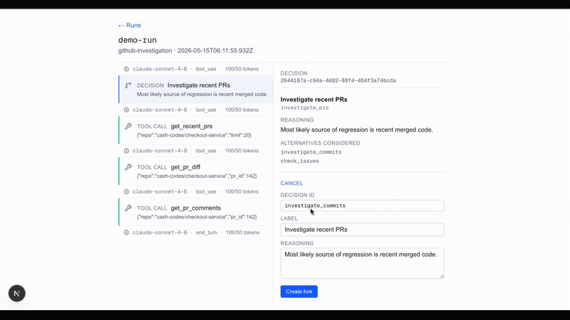
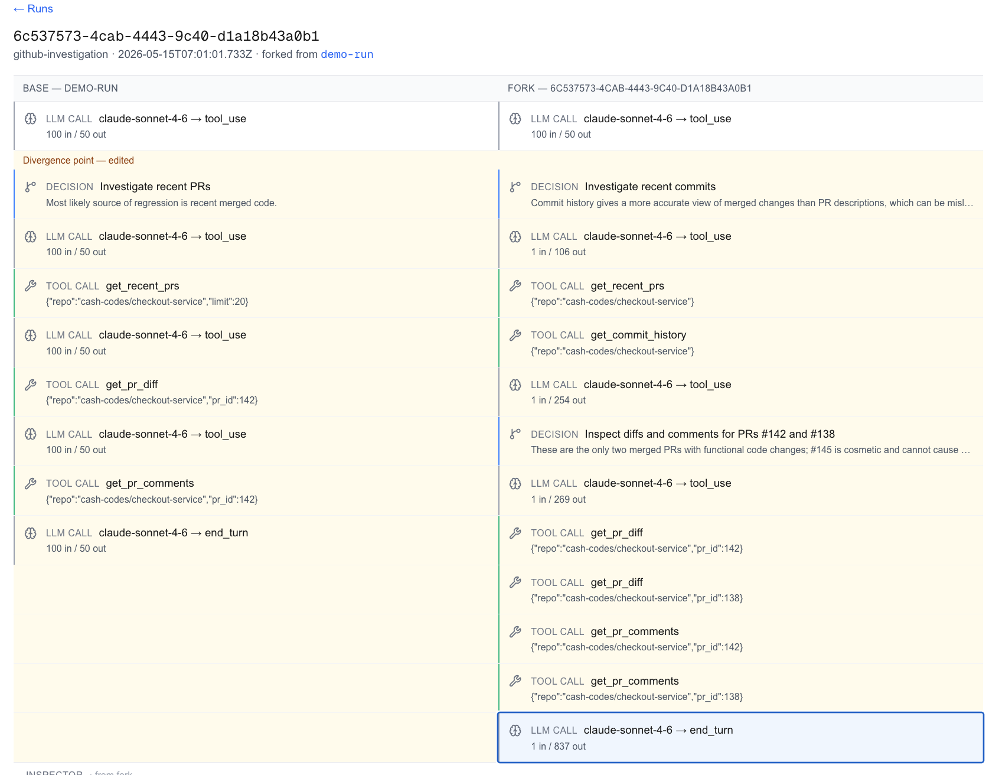

# 🧪 Adaptive Workspace

A replay debugger for LLM agent runs. Records every LLM call, tool call and explicit decision so a run can be replayed identically, forked from an edited tool result or decision and compared side-by-side at the exact divergence point.

The interesting layer is everything around the LLM call - request hashing for deterministic replay, runtime-event capture for time and randomness, two-mode tool execution (snapshot vs live) and a fork engine that swaps the LLM provider mid-loop without rewriting the agent.

[](https://github.com/Cash-Codes/AI_adaptive_workspace/actions/workflows/ci.yml)

[](#)

[](#)
[](#)
[](#)
[](#)
[](#)
[](#)

## 🌐 Live Demo

🔗 https://adaptive-workspace-664876960543.europe-west2.run.app

The deployed instance runs without an `ANTHROPIC_API_KEY`, so live fork creation surfaces a setup error. Pre-baked fixtures (`/runs/demo-run` and `/runs/demo-fork`) demonstrate the replay and side-by-side flow without an API key.

## 🎥 Demo



## Live Flow

```
Agent investigates a GitHub regression (recorded fixture or live)
  → Orchestrator emits LLMCall + ToolCall + Decision + RuntimeEvent
    → JSON event log persisted to data/runs/<id>.json
      → Snapshot replay reproduces the run byte-identically (no LLM call)
        → User clicks a tool result or decision → "Edit and fork"
          → createFork() server action
            → rebuildStateUpToFork() walks events, applies edit
              → WorkflowOrchestrator.run(goal, { initialState })
                → live AnthropicLLMProvider continues the agent loop
                  → new run persisted with base_run_id + fork_point
                    → /runs/<forkId> renders SideBySideRunView
                      → divergence point banner + post-fork amber tint
                        → inline EventInspector swaps content per side
```

The recording is deterministic (snapshot replay), the fork is real (live LLM call) and the divergence is visible at the exact event where the runs split.

## ✨ Features

- Three first-class event types: **LLMCall** (replay unit), **ToolCall** (fork unit), **Decision** (narrative unit), plus **RuntimeEvent** for time and randomness
- **Snapshot replay** - byte-identical reproduction of a recorded run with zero LLM calls
- **Live fork creation** - edit a recorded tool output or decision; the agent re-investigates from that point via real Anthropic API
- **Side-by-side run comparison** - aligned by event id, divergence marker on first non-matching pair, amber tint over the entire post-fork region
- **Inline event inspector** - full request/response detail per event, including system prompt, messages, response content, request hash, token usage
- **Frozen GitHub-investigation demo** - synthetic snapshot of a 10-PR repo with a seeded regression, runnable without GitHub credentials
- **Demo mode** - pre-baked `demo-run.json` and `demo-fork.json` so the UI is fully usable without an Anthropic key

## 🖼️ Screenshots



## 🧠 Tech Stack

**App**

| Technology   | Version | Role                                           |
| ------------ | ------- | ---------------------------------------------- |
| Next.js      | 16      | App Router, server components, server actions  |
| React        | 19      | UI framework                                   |
| TypeScript   | 5       | Strict mode, no `any`                          |
| Tailwind CSS | 4       | Utility-first styling (postcss plugin variant) |
| lucide-react | 1       | Icon set                                       |
| Zod          | 4       | Event schema validation + inferred types       |

**Agent runtime**

| Component               | Role                                                                                 |
| ----------------------- | ------------------------------------------------------------------------------------ |
| `LLMProvider` interface | Abstracts model calls; takes `LLMRequest`, returns `LLMResponse`                     |
| `MockLLMProvider`       | Scripted responses for tests and demo fixtures                                       |
| `AnthropicLLMProvider`  | Real Claude Sonnet 4.6 via `@anthropic-ai/sdk`, with prompt caching                  |
| `SnapshotLLMProvider`   | Replays recorded responses by `request_hash`                                         |
| `Runtime`               | `now()` and `uuid()` with record/replay modes                                        |
| `WorkflowOrchestrator`  | The agent loop - dispatches tools, records events, supports `initialState` for forks |
| `replayRun()`           | Byte-identical reproduction of a recorded run                                        |
| `forkRun()`             | Edit-and-replay-from-edit with live LLM continuation                                 |

**Tooling**

| Technology              | Role                                                                   |
| ----------------------- | ---------------------------------------------------------------------- |
| `JsonRunStore`          | JSON-on-disk run persistence with Zod validation on read               |
| `ToolRunner`            | Snapshot/live mode tool dispatch with lenient fallback for live agents |
| Frozen `githubSnapshot` | 10-PR synthetic repo (4 GitHub-style tools)                            |
| Vitest 4 + happy-dom    | Test runner + DOM environment                                          |
| @testing-library/react  | Component tests                                                        |

**Infrastructure**

| Technology           | Role                                                                             |
| -------------------- | -------------------------------------------------------------------------------- |
| Docker (multi-stage) | Next.js standalone output + bundled `data/runs/` fixtures                        |
| Google Cloud Run     | Production hosting (europe-west2)                                                |
| Artifact Registry    | Container image storage                                                          |
| GitHub Actions       | CI: typecheck, lint, format-check, test, build                                   |
| Husky                | pre-commit (lint-staged) + pre-push (typecheck + test) + commit-msg (commitlint) |

## Architecture

```
adaptive-workspace/
├── app/
│   ├── page.tsx                   RunList page (server component)
│   ├── runs/[id]/page.tsx         Run detail (single OR side-by-side, fork-aware)
│   ├── api/health/route.ts        Health check (Cloud Run probe)
│   ├── actions/fork.ts            "use server" createFork action
│   ├── layout.tsx                 Root layout
│   └── globals.css                Tailwind base
├── components/
│   ├── RunList.tsx                Table of recorded runs
│   ├── RunDetail.tsx              Timeline + inspector (client component)
│   ├── RunTimeline.tsx            Event list, LLM calls collapsed
│   ├── EventCard.tsx              Per-event-type summary card
│   ├── EventInspector.tsx         Full event detail with optional fork panel
│   ├── JsonViewer.tsx             Pretty-printed JSON block
│   ├── SideBySideRunView.tsx      Two-column aligned timeline + inspector
│   └── ForkEditPanel.tsx          Edit-and-fork form (tool_output and decision variants)
├── lib/
│   ├── events.ts                  Zod schemas for all event types
│   ├── hash.ts                    canonicalJSONStringify + sha256Hex
│   ├── format.ts                  shortId(id) helper
│   ├── storage/
│   │   └── json-store.ts          JsonRunStore (one JSON file per run)
│   ├── server/
│   │   └── runs.ts                listRuns(), getRun(id) - server-only
│   ├── tools/
│   │   ├── types.ts               Tool, ToolContext, Snapshot
│   │   ├── registry.ts            tools array + toolsByName map
│   │   ├── runner.ts              ToolRunner (snapshot/live, lenient fallback)
│   │   └── get-*.ts               Four GitHub tools (recent_prs, pr_diff, pr_comments, commit_history)
│   └── runtime/
│       ├── llm-provider.ts        LLMProvider interface + type aliases
│       ├── mock-provider.ts       Scripted response queue
│       ├── anthropic-provider.ts  Real Anthropic SDK wrapper with prompt caching
│       ├── snapshot-llm-provider.ts  Indexes recorded LLMCalls by request_hash
│       ├── runtime-utils.ts       Runtime class (record/replay modes)
│       ├── orchestrator.ts        WorkflowOrchestrator (the agent loop)
│       ├── system-prompt.ts       emit_decision tool + buildSystemPrompt()
│       ├── replay.ts              replayRun() - byte-identical reproduction
│       └── fork.ts                forkRun() + ForkEdit types
├── fixtures/
│   └── github-snapshot.ts         10-PR synthetic repo with seeded regression
├── data/runs/
│   ├── demo-run.json              Pre-generated base run
│   └── demo-fork.json             Pre-generated fork (live mode creates fresh ones)
├── scripts/
│   ├── generate-demo-run.ts       npm run demo:run
│   └── generate-demo-fork.ts      npm run demo:fork
├── tests/                         Vitest suite (~100 tests, foundation → ui)
└── Dockerfile                     Multi-stage (Next.js standalone + bundled fixtures)
```

**Request pipeline (view):**

```
Browser navigates to /runs/<id>
  → app/runs/[id]/page.tsx (server component)
    → getRun(id) reads JSON from data/runs/<id>.json
    → If metadata.base_run_id is set, also load the base run
    → Choose renderer:
        Single run    → <RunDetail>        timeline + inspector
        Fork run      → <SideBySideRunView> base | fork, aligned, with inspector below
      URL ?event=<id>&side=<base|fork> selects which event the inspector shows
```

**Fork pipeline (create):**

```
User clicks "Edit and fork" in inspector → submits ForkEditPanel
  → createFork(baseRunId, edit) server action
    → JsonRunStore.read(baseRunId)
      → rebuildStateUpToFork() walks base.events
        → copies pre-fork events verbatim
        → applies edit to the fork-point event (tool_output or decision)
        → rebuilds messages array up to the fork point
      → WorkflowOrchestrator.run(goal, { initialState })
        → live AnthropicLLMProvider continues the agent loop
        → new typed events + runtime events recorded
      → JsonRunStore.write(fork) with metadata.base_run_id + fork_point
    → returns { forkRunId }
  → router.push(/runs/<forkRunId>)
    → SideBySideRunView aligns base vs fork by event id
```

## Setup

### Prerequisites

- Node.js 22+
- Git
- An Anthropic API key (only required for **live** fork creation; demo fixtures work without one)
- Docker (only required for local container testing or Cloud Run deploy)

### 1. Clone and install

```bash
git clone https://github.com/Cash-Codes/AI_adaptive_workspace.git
cd AI_adaptive_workspace
npm install
```

### 2. Configure environment (optional)

```bash
cp .env.example .env.local
```

Edit `.env.local`:

```env
# Required only for live fork creation
ANTHROPIC_API_KEY=sk-ant-...

# Optional: live GitHub mode for tools (default: snapshot mode against fixture)
GITHUB_TOKEN=ghp_...

# Optional: override the run storage directory (default: ./data/runs)
RUNS_DIR=./data/runs
```

See [Environment Variables](#environment-variables) for the full reference.

### 3. (Optional) Regenerate the demo fixtures

The repo ships with `data/runs/demo-run.json` and `data/runs/demo-fork.json`. To regenerate them locally:

```bash
npm run demo:run     # creates data/runs/demo-run.json
npm run demo:fork    # creates data/runs/demo-fork.json (forks demo-run)
```

Both scripts use `MockLLMProvider` so no API key is needed at fixture-generation time.

### 4. Start the dev server

```bash
npm run dev
```

Open `http://localhost:3000`. You should see the run list with `demo-run` and `demo-fork`.

### 5. Try the demo flow

1. Click **demo-run** - shows the recorded agent investigation, with timeline + inspector
2. Click any event - inspector loads its full detail (request/response/result)
3. Click a tool call or decision - inspector shows an "Edit and fork" button
4. (With `ANTHROPIC_API_KEY` set) edit the value and click **Create fork** - the agent re-investigates against the edited context via a real Claude call (~30-60s)
5. Lands on `/runs/<new-fork-id>` - side-by-side view with the divergence point highlighted

## Docker (local testing)

```bash
# Build (use --platform linux/amd64 if you're on Apple Silicon)
docker build --platform linux/amd64 -t adaptive-workspace:local .

# Run (live fork mode)
docker run --rm -p 3000:3000 \
  -e ANTHROPIC_API_KEY=sk-ant-... \
  adaptive-workspace:local

# Run (demo-only mode - no API key)
docker run --rm -p 3000:3000 adaptive-workspace:local
```

Open `http://localhost:3000`. The container ships with `data/runs/demo-run.json` and `data/runs/demo-fork.json` baked in.

## Cloud Run Deployment

### 1. Authenticate with Google Cloud

```bash
gcloud auth login
gcloud config set project YOUR_PROJECT_ID
```

### 2. Create Artifact Registry repo (once)

```bash
export REGION=europe-west2
export PROJECT_ID=your-gcp-project

gcloud services enable run.googleapis.com artifactregistry.googleapis.com

gcloud artifacts repositories create adaptive-workspace \
  --repository-format=docker \
  --location=${REGION}

gcloud auth configure-docker ${REGION}-docker.pkg.dev
```

### 3. Build and push the image

```bash
docker build \
  --platform linux/amd64 \
  -t ${REGION}-docker.pkg.dev/${PROJECT_ID}/adaptive-workspace/app:latest \
  .

docker push ${REGION}-docker.pkg.dev/${PROJECT_ID}/adaptive-workspace/app:latest
```

### 4. Deploy

```bash
gcloud run deploy adaptive-workspace \
  --image ${REGION}-docker.pkg.dev/${PROJECT_ID}/adaptive-workspace/app:latest \
  --region ${REGION} \
  --platform managed \
  --allow-unauthenticated \
  --port 3000 \
  --memory 512Mi \
  --cpu 1 \
  --min-instances 0 \
  --max-instances 3 \
  --timeout 60s
```

The deploy prints a service URL (e.g. `https://adaptive-workspace-XXX.europe-west2.run.app`).

### 5. (Optional) Add the API key for live fork creation

Without this, live forks return a setup error. Skipping it is **recommended** for public demos - no one can burn your API quota.

```bash
gcloud run services update adaptive-workspace \
  --region ${REGION} \
  --update-env-vars ANTHROPIC_API_KEY=sk-ant-...
```

### 6. Verify

```bash
SERVICE_URL=$(gcloud run services describe adaptive-workspace --region ${REGION} --format='value(status.url)')
curl -s "$SERVICE_URL/api/health"
curl -s -o /dev/null -w "/runs/demo-run → %{http_code}\n" "$SERVICE_URL/runs/demo-run"
curl -s -o /dev/null -w "/runs/demo-fork → %{http_code}\n" "$SERVICE_URL/runs/demo-fork"
```

## Testing

```bash
# All tests
npm test

# Watch mode
npm run test:watch

# UI mode
npm run test:ui

# Typecheck only
npm run typecheck

# Lint
npm run lint

# Format check
npm run format:check
```

The test suite covers the foundation (events, hash, storage), tools (4 GitHub tools + runner), runtime (LLM providers orchestrator, replay, fork) and UI (RunTimeline, EventInspector, SideBySideRunView, server actions). Component tests run against happy-dom. Server-action tests use `vi.mock` to swap `AnthropicLLMProvider` for a scripted mock so no real API calls are made during CI.

A Husky pre-commit hook runs `lint-staged` (eslint + prettier on staged files). Pre-push runs typecheck and the full test suite. Commit messages are validated against conventional-commits via commitlint.

## Demo Mode

The repo ships with two pre-baked fixtures so the UI is fully usable without any external credentials:

- `data/runs/demo-run.json` - the base run, agent concludes PR #142 caused the regression
- `data/runs/demo-fork.json` - a pre-generated fork where the agent investigates PR #138 instead

Both render the same in the UI as a live-created run would. Live fork creation (via the `Edit and fork` panel) requires `ANTHROPIC_API_KEY` and replaces the pre-baked fork with a fresh one.

To start clean:

```bash
rm data/runs/demo-fork.json
npm run demo:fork    # regenerate from demo-run
```

## Environment Variables

| Variable            | Required           | Default       | Description                                                                                            |
| ------------------- | ------------------ | ------------- | ------------------------------------------------------------------------------------------------------ |
| `ANTHROPIC_API_KEY` | For live fork only | -             | Anthropic API key for live `AnthropicLLMProvider` (otherwise the server action surfaces a setup error) |
| `GITHUB_TOKEN`      | No                 | -             | GitHub PAT for live tool mode (default is snapshot mode against the synthetic fixture)                 |
| `RUNS_DIR`          | No                 | `./data/runs` | Directory for `JsonRunStore` reads/writes                                                              |
| `NODE_ENV`          | No                 | `development` | Runtime environment                                                                                    |
| `PORT`              | No                 | `3000`        | Server listen port (Cloud Run sets this)                                                               |
| `HOSTNAME`          | No                 | `0.0.0.0`     | Bind address (Docker/Cloud Run)                                                                        |

## Troubleshooting

**`/runs/demo-run` returns 500 with ENOENT**
The container image is missing `data/runs/demo-run.json`. Confirm the Dockerfile's runner stage includes `COPY --from=builder /app/data ./data` and rebuild.

**Live fork returns "ANTHROPIC_API_KEY env var is not set"**
Set the key in `.env.local` (local) or via `gcloud run services update --update-env-vars` (Cloud Run). The fixture-based demo path doesn't need this.

**Live fork returns "404 model: mock-model"**
The fixture's `LLMCallRecord.request.model` was set to a non-real model name. Regenerate the demo fixtures with the real model:

```bash
# scripts/generate-demo-run.ts and generate-demo-fork.ts must use a real Claude model id
npm run demo:run
npm run demo:fork
```

**Snapshot lookup throws "No snapshot entry for X matching arguments Y"**
The live LLM (post-fork) used a different argument shape than the recorded base. `ToolRunner` falls back to the first entry for that tool when no exact match exists - if you see this error, the tool isn't in the snapshot at all. Add an entry to `fixtures/github-snapshot.ts`.

**The amber post-fork tint isn't showing in the side-by-side view**
`EventCard` must use a transparent background so the parent's tint shows through. Confirm `components/EventCard.tsx` does not have `bg-white` in its className.

---

Good luck and feel free to reach out if you need any clarification or would like to contribute further. Always happy to help. Thanks!

---

**Document Version:** 1.0
**Last Updated:** May, 2026
**Maintainer:** Cashley <cashley.dps@gmail.com>
