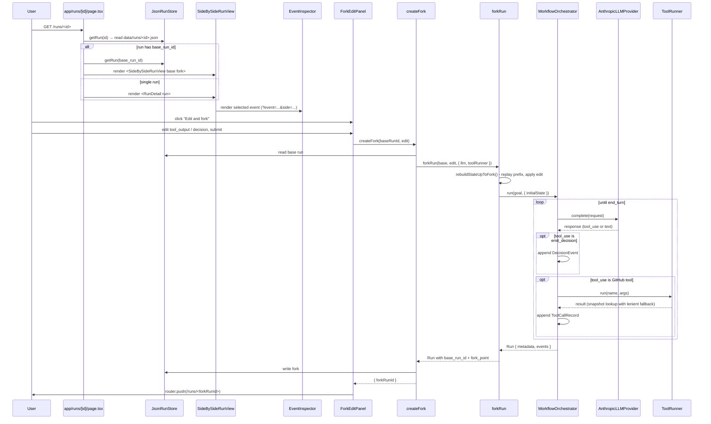

# Adaptive Workspace - Technical Guide

---

## Table of Contents

1. [What the app does](#1-what-the-app-does)
2. [Project structure](#2-project-structure)
3. [Full request flow (diagram)](#3-full-request-flow-diagram)
4. [Foundation layer](#4-foundation-layer)
   - 4.1 [Events - `lib/events.ts`](#41-events--libeventsts)
   - 4.2 [Hashing - `lib/hash.ts`](#42-hashing--libhashts)
   - 4.3 [Formatting - `lib/format.ts`](#43-formatting--libformatts)
   - 4.4 [Storage - `lib/storage/json-store.ts`](#44-storage--libstoragejson-storets)
   - 4.5 [Server reads - `lib/server/runs.ts`](#45-server-reads--libserverrunsts)
5. [Tools layer](#5-tools-layer)
   - 5.1 [Tool contract - `lib/tools/types.ts`](#51-tool-contract--libtoolstypests)
   - 5.2 [Registry - `lib/tools/registry.ts`](#52-registry--libtoolsregistryts)
   - 5.3 [GitHub tools - `lib/tools/get-*.ts`](#53-github-tools--libtoolsget-ts)
   - 5.4 [Runner - `lib/tools/runner.ts`](#54-runner--libtoolsrunnerts)
   - 5.5 [Synthetic snapshot - `fixtures/github-snapshot.ts`](#55-synthetic-snapshot--fixturesgithub-snapshotts)
6. [Agent runtime](#6-agent-runtime)
   - 6.1 [LLMProvider interface - `lib/runtime/llm-provider.ts`](#61-llmprovider-interface--libruntimellm-providerts)
   - 6.2 [MockLLMProvider - `lib/runtime/mock-provider.ts`](#62-mockllmprovider--libruntimemock-providerts)
   - 6.3 [AnthropicLLMProvider - `lib/runtime/anthropic-provider.ts`](#63-anthropicllmprovider--libruntimeanthropic-providerts)
   - 6.4 [Runtime (time + uuid) - `lib/runtime/runtime-utils.ts`](#64-runtime-time--uuid--libruntimeruntime-utilsts)
   - 6.5 [System prompt + `emit_decision` - `lib/runtime/system-prompt.ts`](#65-system-prompt--emit_decision--libruntimesystem-promptts)
   - 6.6 [WorkflowOrchestrator - `lib/runtime/orchestrator.ts`](#66-workfloworchestrator--libruntimeorchestratorts)
7. [Replay engine](#7-replay-engine)
   - 7.1 [SnapshotLLMProvider - `lib/runtime/snapshot-llm-provider.ts`](#71-snapshotllmprovider--libruntimesnapshot-llm-providerts)
   - 7.2 [`replayRun()` - `lib/runtime/replay.ts`](#72-replayrun--libruntimereplayts)
8. [Fork engine](#8-fork-engine)
   - 8.1 [`ForkEdit` and `forkRun()` - `lib/runtime/fork.ts`](#81-forkedit-and-forkrun--libruntimeforkts)
   - 8.2 [`rebuildStateUpToFork()`](#82-rebuildstateuptofork)
   - 8.3 [Continuation via `initialState`](#83-continuation-via-initialstate)
9. [Server actions and routes](#9-server-actions-and-routes)
   - 9.1 [`createFork` - `app/actions/fork.ts`](#91-createfork--appactionsforkts)
   - 9.2 [Run pages - `app/page.tsx` and `app/runs/[id]/page.tsx`](#92-run-pages--apppagetsx-and-apprunsidpagetsx)
   - 9.3 [Health route - `app/api/health/route.ts`](#93-health-route--appapihealthroutets)
10. [UI walkthrough](#10-ui-walkthrough)
    - 10.1 [RunList](#101-runlist)
    - 10.2 [RunDetail + RunTimeline](#102-rundetail--runtimeline)
    - 10.3 [EventCard](#103-eventcard)
    - 10.4 [EventInspector + JsonViewer](#104-eventinspector--jsonviewer)
    - 10.5 [SideBySideRunView](#105-sidebysiderunview)
    - 10.6 [ForkEditPanel](#106-forkeditpanel)
11. [Demo fixtures and scripts](#11-demo-fixtures-and-scripts)
12. [Docker and Cloud Run deployment](#12-docker-and-cloud-run-deployment)
13. [Testing strategy](#13-testing-strategy)
14. [Security model](#14-security-model)
15. [Key design decisions and trade-offs](#15-key-design-decisions-and-trade-offs)

---

## 1. What the app does

A user opens a recorded LLM agent run. The app:

1. Loads the run from `data/runs/<id>.json`
2. Renders the timeline of typed events (LLM calls, tool calls, decisions)
3. Lets the user click any event to inspect its full request/response/result
4. For tool calls and decisions, exposes an "Edit and fork" panel
5. On submit, runs the agent loop again from the edited event using a real Anthropic API call
6. Persists the new run with `base_run_id` and `fork_point` metadata
7. Redirects to the side-by-side view, where the two runs are aligned by event id and the divergence point is highlighted

A recorded run can also be **replayed** - the same orchestrator loop runs against `SnapshotLLMProvider` (which serves recorded responses by `request_hash`) and produces a byte-identical output. No LLM call is made.

When `ANTHROPIC_API_KEY` is unset, the app runs in **demo mode** - pre-baked `demo-run.json` and `demo-fork.json` fixtures are viewable end-to-end, but live fork creation surfaces a setup error.

The interesting layer is everything around the LLM call: a canonical-JSON-hashed request becomes the replay key, a runtime captures `now()`/`uuid()` so time and randomness replay deterministically, the agent loop is `initialState`-aware so forks reuse the same code path and the tool runner has two modes (snapshot vs live) so the same agent works against frozen fixtures or real APIs.

---

## 2. Project structure

```
adaptive-workspace/
├── app/
│   ├── page.tsx                 RunList host (server component - listRuns())
│   ├── runs/[id]/page.tsx       Run detail (fork-aware: single OR side-by-side)
│   ├── actions/fork.ts          "use server" - createFork() action
│   ├── api/health/route.ts      GET /api/health (Cloud Run probe)
│   ├── layout.tsx               Root layout (Geist fonts, Tailwind)
│   └── globals.css              Tailwind base
├── components/
│   ├── RunList.tsx              Table of recorded runs
│   ├── RunDetail.tsx            Timeline + inspector for a single run
│   ├── RunTimeline.tsx          Event list (LLM calls collapsed)
│   ├── EventCard.tsx            Per-event-type summary card
│   ├── EventInspector.tsx       Full event detail + optional ForkEditPanel
│   ├── JsonViewer.tsx           Pretty-printed JSON block
│   ├── SideBySideRunView.tsx    Two-column aligned timeline + inspector
│   └── ForkEditPanel.tsx        Edit-and-fork form (tool_output + decision)
├── lib/
│   ├── events.ts                Zod schemas for every event type
│   ├── hash.ts                  canonicalJSONStringify + sha256Hex
│   ├── format.ts                shortId() helper
│   ├── storage/
│   │   └── json-store.ts        JsonRunStore (one JSON file per run)
│   ├── server/
│   │   └── runs.ts              listRuns() + getRun() - server-only
│   ├── tools/
│   │   ├── types.ts             Tool, ToolContext, Snapshot
│   │   ├── registry.ts          tools[] + toolsByName map
│   │   ├── runner.ts            ToolRunner (snapshot/live + lenient fallback)
│   │   ├── get-recent-prs.ts    List PRs for a repo
│   │   ├── get-pr-diff.ts       Unified diff for a PR
│   │   ├── get-pr-comments.ts   Issue comments on a PR
│   │   └── get-commit-history.ts Commit log filtered by since
│   └── runtime/
│       ├── llm-provider.ts      LLMProvider interface + type aliases
│       ├── mock-provider.ts     Scripted response queue (tests, fixtures)
│       ├── anthropic-provider.ts Real Anthropic SDK wrapper + prompt caching
│       ├── snapshot-llm-provider.ts Index of recorded responses by request_hash
│       ├── runtime-utils.ts     Runtime class (record/replay for now/uuid)
│       ├── system-prompt.ts     emit_decision tool + buildSystemPrompt()
│       ├── orchestrator.ts      WorkflowOrchestrator - the agent loop
│       ├── replay.ts            replayRun() - byte-identical reproduction
│       └── fork.ts              forkRun() + ForkEdit + rebuildStateUpToFork()
├── fixtures/
│   └── github-snapshot.ts       10-PR synthetic repo with a seeded regression
├── data/runs/
│   ├── demo-run.json            Pre-generated base run
│   └── demo-fork.json           Pre-generated fork
├── scripts/
│   ├── generate-demo-run.ts     npm run demo:run
│   └── generate-demo-fork.ts    npm run demo:fork
├── tests/                       Vitest suite (foundation → runtime → UI)
├── Dockerfile                   Multi-stage (Next.js standalone + data/)
├── next.config.ts               output: "standalone"
└── package.json                 Next 16, React 19, TS 5, Tailwind 4, Zod 4
```

**Why this layout?** Each directory has exactly one responsibility. `lib/` is the pure runtime - it never imports from `app/` or `components/`. `lib/tools/` is independent of `lib/runtime/` (the orchestrator depends on a `ToolRunner` interface, not on any specific tool). `app/` owns HTTP and rendering. `components/` is client-only UI. This means the entire agent runtime - events, tools orchestrator, replay, fork - can be tested in isolation from Next.js.

---

## 3. Full request flow (diagram)



---

## 4. Foundation layer

### 4.1 Events - `lib/events.ts`

**File:** `lib/events.ts`

Every recorded run is an array of typed events. There are four event types, modelled as a Zod discriminated union on `type`:

```typescript
export const EventSchema = z.discriminatedUnion("type", [
  LLMCallRecordSchema, // every LLM request + response
  ToolCallRecordSchema, // every tool invocation + result
  DecisionEventSchema, // every emit_decision call
  RuntimeEventSchema, // every now() or uuid() observation
]);
```

| Event type  | Role                                                                                                                                                                                 |
| ----------- | ------------------------------------------------------------------------------------------------------------------------------------------------------------------------------------ |
| `llm_call`  | The **replay unit**. Stores the exact request (system, messages, tools, params), a `request_hash`, the response (content blocks, stop reason, usage) and optional diagnostics.       |
| `tool_call` | The **fork unit**. Stores the tool name, arguments, an `arguments_hash` and the result. The fork engine targets these.                                                               |
| `decision`  | The **narrative unit**. Stores a `decision` id, human label, reasoning and alternatives. Emitted by the LLM via the `emit_decision` tool.                                            |
| `runtime`   | Non-deterministic ambient observations: `Date.now()` (`kind: "now"`) and `randomUUID()` (`kind: "random_uuid"`). Filtered out of UI timelines; replayed by `Runtime` in replay mode. |

**Why a discriminated union on `type`?** Zod's `z.discriminatedUnion` produces a TypeScript discriminated union (`Event = LLMCallRecord | ToolCallRecord | DecisionEvent | RuntimeEvent`) where narrowing on `event.type === "llm_call"` gives you typed access to the inner shape. The same schema is used to validate on read - runs that drift from this shape fail loudly at `JsonRunStore.read()` instead of producing a `TypeError` somewhere downstream.

**Why store `request_hash` and `arguments_hash`?** They are the lookup keys for snapshot replay and snapshot tool mode. The hash is computed over the canonical JSON form (see §4.2) of the request, so it is stable across re-serialisations and key reorderings.

---

### 4.2 Hashing - `lib/hash.ts`

**File:** `lib/hash.ts`

A canonical JSON serialiser plus a sha256 helper:

```typescript
export function canonicalJSONStringify(value: unknown): string {
  if (value === null || typeof value !== "object") return JSON.stringify(value);
  if (Array.isArray(value)) return "[" + value.map(canonicalJSONStringify).join(",") + "]";
  const obj = value as Record<string, unknown>;
  const keys = Object.keys(obj).sort();
  const parts = keys.map((k) => JSON.stringify(k) + ":" + canonicalJSONStringify(obj[k]));
  return "{" + parts.join(",") + "}";
}

export function sha256Hex(input: string): string {
  return createHash("sha256").update(input).digest("hex");
}

export function hashCanonical(value: unknown): string {
  return sha256Hex(canonicalJSONStringify(value));
}
```

**Why canonical, not just `JSON.stringify`?** `JSON.stringify` preserves insertion order of object keys. Two structurally identical objects with different key insertion order would produce different hashes - and therefore different snapshot lookups. Canonical stringification sorts object keys recursively so the byte output depends only on the value, not on how it was built.

**Where the hash is used:**

| Field                           | Hashed value                                                   | Used by                                  |
| ------------------------------- | -------------------------------------------------------------- | ---------------------------------------- |
| `LLMCallRecord.request_hash`    | The full `LLMRequest` (model, system, messages, tools, params) | `SnapshotLLMProvider` for replay lookups |
| `ToolCallRecord.arguments_hash` | The arguments object passed to the tool                        | Diagnostics / future caching             |
| `ToolRunner.lookupSnapshot()`   | The arguments object                                           | Snapshot-mode tool dispatch              |

---

### 4.3 Formatting - `lib/format.ts`

**File:** `lib/format.ts`

One helper that abbreviates ids for display:

```typescript
export function shortId(id: string): string {
  return id.length <= 16 ? id : `${id.slice(0, 8)}…`;
}
```

**Why a length cutoff instead of always-truncate?** UUID ids are 36 characters and unreadable in a table - the first eight characters are enough for identification. But fixture ids like `demo-run` and `demo-fork` are already short and meaningful; truncating them to `demo-run` (no change) or `demo-for…` (mangled) is worse than leaving them whole. The 16-char threshold preserves both.

---

### 4.4 Storage - `lib/storage/json-store.ts`

**File:** `lib/storage/json-store.ts`

Runs are persisted as one JSON file per run under `data/runs/<id>.json`. The store is a thin filesystem layer with Zod validation on read.

```typescript
export class JsonRunStore {
  constructor(private rootDir: string) {}

  async write(run: Run): Promise<void> {
    await this.ensureDir();
    await fs.writeFile(this.pathFor(run.metadata.id), JSON.stringify(run, null, 2), "utf8");
  }

  async read(runId: string): Promise<Run> {
    const content = await fs.readFile(this.pathFor(runId), "utf8");
    return RunSchema.parse(JSON.parse(content)); // Zod validates the shape
  }

  async list(): Promise<RunMetadata[]> {
    const files = await fs.readdir(this.rootDir);
    const metas: RunMetadata[] = [];
    for (const f of files) {
      if (!f.endsWith(".json")) continue;
      const parsed = JSON.parse(await fs.readFile(join(this.rootDir, f), "utf8"));
      metas.push(RunMetadataSchema.parse(parsed.metadata));
    }
    return metas.sort((a, b) => b.created_at - a.created_at);
  }
}
```

**Run shape:**

```typescript
{
  metadata: {
    id: string;
    created_at: number;             // epoch ms - sortable
    workflow: string;
    base_run_id?: string;           // set on forks → triggers SideBySideRunView
    fork_point?: { event_id: string };
  },
  events: Event[];                  // chronological, includes runtime events
}
```

**Why JSON-on-disk instead of SQLite or Postgres?** A run is a single self-contained document; querying across runs is rare (the only list operation reads every file). The full document is read on every page load and pretty-printed in the inspector - JSON is its native form. A real production deployment would swap `JsonRunStore` for an object-store backend, but `JsonStore` is enough for the replay-debugger MVP and keeps the read path inspectable.

**Why validate on read, not on write?** A write fault corrupts a file you control; a read fault means the data already on disk doesn't match the current schema. Validation on read catches schema drift between commits (e.g. an old recording missing a new field).

---

### 4.5 Server reads - `lib/server/runs.ts`

**File:** `lib/server/runs.ts`

A pair of server-only wrappers that read `RUNS_DIR` from the environment and call into `JsonRunStore`.

```typescript
import "server-only";

function store(): JsonRunStore {
  const dir = process.env.RUNS_DIR ?? "./data/runs";
  return new JsonRunStore(dir);
}

export async function listRuns(): Promise<RunMetadata[]> {
  return store().list();
}
export async function getRun(id: string): Promise<Run> {
  return store().read(id);
}
```

**Why `import "server-only"`?** It is a compile-time guard from Next.js. If a client component accidentally imports this module, the bundler errors out before runtime. The store reaches the filesystem - there is no client-side analogue and no graceful fallback.

---

## 5. Tools layer

### 5.1 Tool contract - `lib/tools/types.ts`

**File:** `lib/tools/types.ts`

Every tool implements one interface:

```typescript
export type Tool<TInput = unknown, TOutput = unknown> = {
  name: string;
  description: string;
  inputSchema: z.ZodType<TInput>;
  outputSchema: z.ZodType<TOutput>;
  execute(input: TInput, ctx: ToolContext): Promise<TOutput>;
};

export type ToolContext = { githubToken?: string };
export type ToolRunMode = "snapshot" | "live";
```

**Why Zod schemas on both sides?** The agent's tool call goes through `inputSchema.parse()` before `execute` runs - invalid arguments fail in the runner, not in the tool body. The result is run through `outputSchema.parse()` before being recorded, so a downstream GitHub API change that returns an unexpected shape fails loudly at the seam instead of silently corrupting the event stream.

**Snapshot schema:**

```typescript
export const SnapshotSchema = z.record(z.string(), z.array(SnapshotEntrySchema));
// { [toolName]: [{ arguments, result }, ...] }
```

A snapshot is a frozen list of `(arguments, result)` pairs per tool name. The runner looks up by canonical-JSON-equality on arguments.

---

### 5.2 Registry - `lib/tools/registry.ts`

**File:** `lib/tools/registry.ts`

A small module that exports the canonical tool list:

```typescript
export const tools: Tool[] = [getRecentPrs, getPrDiff, getPrComments, getCommitHistory];
export const toolsByName: Map<string, Tool> = new Map(tools.map((t) => [t.name, t]));
```

**Why a registry rather than just exporting each tool?** The orchestrator and the demo scripts need a single source of truth for "the tools available to this agent." Registering in one place makes it impossible for the orchestrator's tool definitions and the snapshot fixture to drift apart silently.

---

### 5.3 GitHub tools - `lib/tools/get-*.ts`

Four tools, all stamped to the same shape: a Zod input schema, a Zod output schema and an `execute` that hits the GitHub REST API with an optional bearer token from `ToolContext`.

| Tool                 | Endpoint                                                                             | Returns                                                                 |
| -------------------- | ------------------------------------------------------------------------------------ | ----------------------------------------------------------------------- |
| `get_recent_prs`     | `GET /repos/{owner}/{repo}/pulls?state=all&per_page=N`                               | Array of PR summaries (number, title, body, state, user, head/base SHA) |
| `get_pr_diff`        | `GET /repos/{owner}/{repo}/pulls/{id}` with `Accept: application/vnd.github.v3.diff` | Raw unified diff text                                                   |
| `get_pr_comments`    | `GET /repos/{owner}/{repo}/issues/{id}/comments`                                     | Array of comment objects                                                |
| `get_commit_history` | `GET /repos/{owner}/{repo}/commits?since=...`                                        | Array of `{ sha, commit: { message, author } }`                         |

```typescript
// lib/tools/get-recent-prs.ts (representative)
export const getRecentPrs: Tool<...> = {
  name: "get_recent_prs",
  description: "List recent pull requests for a GitHub repo. ...",
  inputSchema: z.object({ repo: z.string(), limit: z.number().int().positive().optional() }),
  outputSchema: z.array(PRSummary),
  execute: async (input, ctx) => {
    const url = `https://api.github.com/repos/${input.repo}/pulls?state=all&per_page=${input.limit ?? 30}`;
    const res = await fetch(url, {
      headers: {
        Accept: "application/vnd.github+json",
        "X-GitHub-Api-Version": "2022-11-28",
        ...(ctx.githubToken ? { Authorization: `Bearer ${ctx.githubToken}` } : {}),
      },
    });
    if (!res.ok) throw new Error(`GitHub API error: ${res.status} ${res.statusText}`);
    return Output.parse(await res.json());
  },
};
```

**Why GitHub at all?** GitHub is concrete enough to produce a believable agent investigation (a "find the regression-causing PR" workflow) without bringing in a heavyweight integration. The four endpoints chosen are read-only, public and the agent can plausibly reason across them (PR list → PR diff → PR review thread → commit log).

**Why `Authorization` only when a token is set?** GitHub's public read endpoints work unauthenticated (with a low rate limit). Snapshot mode never touches the network, so tokens are not required for the demo flow.

---

### 5.4 Runner - `lib/tools/runner.ts`

**File:** `lib/tools/runner.ts`

The dispatcher. One construct, two modes:

```typescript
async run(name: string, rawArgs: unknown): Promise<unknown> {
  const tool = this.toolsByName.get(name);
  if (!tool) throw new Error(`Unknown tool: ${name}`);
  const input = tool.inputSchema.parse(rawArgs);

  const rawResult =
    this.mode === "snapshot"
      ? this.lookupSnapshot(name, input)
      : await tool.execute(input, this.ctx);

  return tool.outputSchema.parse(rawResult);
}
```

**Snapshot lookup with lenient fallback:**

```typescript
private lookupSnapshot(name: string, input: unknown): unknown {
  const entries = this.snapshot[name] ?? [];
  const target = canonicalJSONStringify(input);
  const match = entries.find((e) => canonicalJSONStringify(e.arguments) === target);
  if (match) return match.result;

  // Live forks: the LLM may pick a slightly different arg shape than the
  // recorded one (e.g. limit 25 vs 20). Fall back to the first entry for
  // the tool so the agent can keep investigating instead of crashing.
  if (entries.length > 0) return entries[0].result;

  throw new Error(`No snapshot entry for ${name} matching arguments ${target}`);
}
```

**Why a lenient fallback?** Snapshot mode is used by two callers with very different expectations. Recorded runs always re-issue the exact same arguments (because the LLM response is replayed verbatim), so an exact match is guaranteed. Live forks run a real LLM that may pick `limit: 25` when the snapshot recorded `limit: 20` - strict matching would crash the fork loop on the first GitHub call. Falling back to the first entry preserves the investigation narrative (the agent still sees a real PR list) while accepting that the fork is a counterfactual exploration, not a byte-replay.

**Why is `outputSchema.parse` outside the if/else?** Both paths produce a `rawResult`; both must be validated. Putting the parse in one place catches both snapshot-shape drift and live-API-shape drift through the same seam.

---

### 5.5 Synthetic snapshot - `fixtures/github-snapshot.ts`

**File:** `fixtures/github-snapshot.ts`

The investigation has two plausible culprits, deliberately constructed:

- **PR #142** - _Refactor user query for performance_. Removes a cached prepared-statement path. Reviewer-1 flags this exact concern in the PR thread.
- **PR #138** - _Add Redis caching layer for product catalog_. Introduces a 5-minute TTL. Reviewer-2 flags TTL behaviour under load.

Eight other PRs are intentionally innocuous (README badges, dep bumps, typo fixes, doc updates) so the agent has noise to filter through. The snapshot has entries for **every** PR's diff and comments (even the empty ones) so live fork explorations don't hit the strict-match path and crash.

**Why one frozen snapshot rather than recording the agent live each time?** Three reasons. First, the demo must work without GitHub credentials. Second, the recording must be deterministic - a live PR list changes every time someone pushes. Third, the snapshot lets the demo seed the "interesting" finding (the two competing-culprit narrative) instead of waiting for a real repo to produce it.

---

## 6. Agent runtime

### 6.1 LLMProvider interface - `lib/runtime/llm-provider.ts`

**File:** `lib/runtime/llm-provider.ts`

The single seam between the orchestrator and the model:

```typescript
export type LLMRequest = LLMCallRecord["request"];
export type LLMResponse = LLMCallRecord["response"];

export interface LLMProvider {
  complete(request: LLMRequest): Promise<LLMResponse>;
}
```

**Why derive the types from `LLMCallRecord`?** The same shape that flows through the provider is the shape that gets recorded. If the recorded `request` has fields the provider needs but doesn't have (or vice versa), the type system would complain at the call site. Single source of truth.

Three implementations exist:

| Provider               | Used for                                                                    |
| ---------------------- | --------------------------------------------------------------------------- |
| `MockLLMProvider`      | Tests and demo fixture generation. Returns scripted responses from a queue. |
| `AnthropicLLMProvider` | Live fork creation. Wraps `@anthropic-ai/sdk` with prompt caching.          |
| `SnapshotLLMProvider`  | Replay. Returns recorded responses by `request_hash`.                       |

---

### 6.2 MockLLMProvider - `lib/runtime/mock-provider.ts`

**File:** `lib/runtime/mock-provider.ts`

A scripted response queue:

```typescript
export class MockLLMProvider implements LLMProvider {
  readonly requests: LLMRequest[] = [];
  private cursor = 0;
  constructor(private readonly scripted: LLMResponse[]) {}

  async complete(request: LLMRequest): Promise<LLMResponse> {
    this.requests.push(request);
    if (this.cursor >= this.scripted.length) {
      throw new Error(`MockLLMProvider exhausted after ${this.scripted.length} response(s)`);
    }
    return this.scripted[this.cursor++];
  }
}
```

The `requests` array is exposed so tests can assert on what the orchestrator actually sent (system prompt, tools, message history). The "exhausted" error catches scripts that don't anticipate enough loop iterations - a silent fallback would make the failure mode harder to diagnose.

---

### 6.3 AnthropicLLMProvider - `lib/runtime/anthropic-provider.ts`

**File:** `lib/runtime/anthropic-provider.ts`

A thin SDK wrapper:

```typescript
export class AnthropicLLMProvider implements LLMProvider {
  private readonly client: Anthropic;
  constructor(config: AnthropicLLMProviderConfig = {}) {
    this.client = config.client ?? new Anthropic(config.apiKey ? { apiKey: config.apiKey } : {});
  }

  async complete(request: LLMRequest): Promise<LLMResponse> {
    const sdkResponse = await this.client.messages.create({
      model: request.model,
      max_tokens: request.params.max_tokens,
      temperature: request.params.temperature,
      system: request.system,
      tools: request.tools as unknown as Anthropic.Messages.Tool[],
      messages: request.messages as unknown as Anthropic.MessageParam[],
      cache_control: { type: "ephemeral" },
    } as Anthropic.Messages.MessageCreateParamsNonStreaming);

    return {
      content: sdkResponse.content as unknown as ContentBlock[],
      stop_reason: sdkResponse.stop_reason ?? "end_turn",
      model_served: sdkResponse.model,
      request_id: sdkResponse.id,
      usage: {
        input_tokens: sdkResponse.usage.input_tokens,
        output_tokens: sdkResponse.usage.output_tokens,
      },
    };
  }
}
```

**Why `cache_control: ephemeral`?** Prompt caching cuts the cost of repeat tool calls in a long agent loop - the system prompt and tool definitions are stable across iterations and the SDK caches them on Anthropic's side. The `ephemeral` cache type is the right choice for an in-process loop; a `persistent` cache would have higher floor cost and longer eviction.

**Why is `client` injectable via config?** The orchestrator test suite uses `vi.mock` to replace the real SDK client with a scripted one. Passing the client through the constructor keeps the production codepath clean while letting tests assert on the exact SDK call shape.

---

### 6.4 Runtime (time + uuid) - `lib/runtime/runtime-utils.ts`

**File:** `lib/runtime/runtime-utils.ts`

A small class that owns `Date.now()` and `randomUUID()` for the orchestrator. In **record** mode it calls the real functions and records each call as a `RuntimeEvent`. In **replay** mode it consumes events from a pre-recorded list in order:

```typescript
now(): number {
  if (this.mode === "replay") return this.consumeReplay("now") as number;
  const value = Date.now();
  this.recordEvent("now", value);
  return value;
}

uuid(): string {
  if (this.mode === "replay") return this.consumeReplay("random_uuid") as string;
  const value = randomUUID();
  this.recordEvent("random_uuid", value);
  return value;
}

private consumeReplay(expectedKind: RuntimeEvent["kind"]): unknown {
  if (this.replayCursor >= this.replayEvents.length) {
    throw new Error(`Runtime replay events exhausted (expected ${expectedKind})`);
  }
  const event = this.replayEvents[this.replayCursor++];
  if (event.kind !== expectedKind) {
    throw new Error(`Runtime replay kind mismatch: expected ${expectedKind}, got ${event.kind}`);
  }
  this.events.push(event);   // mirror record-mode bookkeeping
  return event.value;
}
```

**Why is `now()`/`uuid()` worth recording at all?** Without it, replay would diverge from the recording at the first non-deterministic call. The orchestrator stamps every event with a `timestamp` (from `runtime.now()`) and an `id` (from `runtime.uuid()`). If those are re-rolled on replay, every event has a different id - and the side-by-side view's "align by event id" assumption breaks.

**Why does replay mode still push events into `this.events`?** Consumers (e.g. the orchestrator's `events.push(...this.runtime.events)` at the end of a run) need an identical events array in both modes. If replay produced an empty `events` array, the replayed Run's event count would differ from the recording.

**Kind-mismatch as a hard error:** If `expectedKind` is `"now"` but the next replay event is `"random_uuid"`, the code path has diverged. Throwing immediately at the divergence point makes the failure debuggable; silently swallowing it would push the error several events downstream.

---

### 6.5 System prompt + `emit_decision` - `lib/runtime/system-prompt.ts`

**File:** `lib/runtime/system-prompt.ts`

The agent's behaviour is established by a system prompt and one extra tool that the orchestrator intercepts.

```typescript
export const emitDecisionTool: ToolDefinition = {
  name: "emit_decision",
  description: [
    "Declare an explicit decision point in your investigation.",
    "Call this BEFORE fetching information that depends on a choice you just made,",
    "so the trace records why you went one way and not another.",
    "Fields:",
    "  decision: stable machine-readable identifier (snake_case), e.g. 'investigate_prs'",
    "  label: short human-readable label",
    "  reasoning: one sentence - why this option, not the alternatives",
    "  alternatives: optional list of other decision identifiers you considered",
  ].join("\n"),
  input_schema: { type: "object", properties: { ... }, required: ["decision", "label", "reasoning"] },
};

export function buildSystemPrompt(tools: Tool[]): string {
  const toolDescriptions = tools.map((t) => `- ${t.name}: ${t.description}`).join("\n");
  return [
    "You are an investigation agent in the Adaptive Workspace runtime.",
    "Your job is to investigate a question by calling tools and explicitly declaring your decisions.",
    "",
    "# Tools available",
    toolDescriptions,
    `- ${emitDecisionTool.name}: ${emitDecisionTool.description}`,
    "",
    "# How to work",
    "1. At each fork in your reasoning, call emit_decision BEFORE calling investigative tools.",
    "2. Call tools to gather evidence.",
    "3. Repeat: emit_decision → call tools → ...",
    "4. When you've reached a conclusion, output a final text message. Do not call more tools.",
  ].join("\n");
}
```

**Why is `emit_decision` a tool and not a special message format?** Tool calls go through the model's structured-output path - the response is a typed `tool_use` block with validated input fields, not free-form prose the orchestrator has to regex out. The orchestrator intercepts calls to `emit_decision`, converts them into `DecisionEvent`s in the run and returns a "Decision recorded." tool result so the LLM's turn-taking logic continues normally.

**Why instruct the agent to emit decisions BEFORE fetching dependent information?** Forks are most useful at decision points. If the agent records "I chose to investigate PRs (not commits, not issues)" _before_ it actually pulls the PR list, an editor can fork at that decision and see what happens if the agent had chosen differently. Decisions emitted _after_ the fact are less useful - the information they explain is already in the message history.

---

### 6.6 WorkflowOrchestrator - `lib/runtime/orchestrator.ts`

**File:** `lib/runtime/orchestrator.ts`

The agent loop. One method, `run(goal, options)`, runs the standard tool-using loop:

```typescript
async run(goal: string, options: RunOptions = {}): Promise<Run> {
  const initial = options.initialState;
  const events: Event[] = initial ? [...initial.events] : [];
  const runId = initial?.runId ?? this.runtime.uuid();
  const createdAt = initial?.createdAt ?? this.runtime.now();

  const system = buildSystemPrompt(this.userTools);
  const toolDefinitions: ToolDefinition[] = [
    ...this.userTools.map(toolToDefinition),
    emitDecisionTool,
  ];

  const messages: Message[] = initial ? [...initial.messages] : [{ role: "user", content: goal }];

  for (let i = 0; i < MAX_ITERATIONS; i++) {
    const request: LLMRequest = { model, system, messages, tools, params };
    const requestHash = hashCanonical(request);

    const startedAt = this.runtime.now();         // record runtime obs
    const response = await this.llm.complete(request);
    const endedAt = this.runtime.now();

    const llmCall: LLMCallRecord = {
      type: "llm_call", id: this.runtime.uuid(), timestamp: startedAt,
      request, request_hash: requestHash, response,
      diagnostics: { latency_ms: endedAt - startedAt },
    };
    events.push(llmCall);

    messages.push({ role: "assistant", content: response.content });

    const toolUses = response.content.filter(isToolUse);
    if (toolUses.length === 0) break;             // model finished

    const toolResultsForLLM: ContentBlock[] = [];
    for (const block of toolUses) {
      if (block.name === emitDecisionTool.name) {
        // intercept and convert into a DecisionEvent
        events.push({ type: "decision", id: this.runtime.uuid(), timestamp: this.runtime.now(), ...block.input });
        toolResultsForLLM.push({ type: "tool_result", tool_use_id: block.id, content: "Decision recorded." });
      } else {
        const result = await this.toolRunner.run(block.name, block.input);
        events.push({
          type: "tool_call", id: this.runtime.uuid(), timestamp: this.runtime.now(),
          tool: block.name, arguments: block.input as Record<string, unknown>,
          arguments_hash: hashCanonical(block.input), result: { output: result },
        });
        toolResultsForLLM.push({ type: "tool_result", tool_use_id: block.id, content: JSON.stringify(result) });
      }
    }
    messages.push({ role: "user", content: toolResultsForLLM });
  }

  events.push(...this.runtime.events);            // append runtime tail
  return { metadata: { id: runId, created_at: createdAt, workflow: this.workflow }, events };
}
```

**Why `MAX_ITERATIONS = 32`?** A safety bound to prevent a misbehaving model from looping forever. The demo investigations finish in 5–10 LLM calls; 32 is well past any legitimate workload.

**Why time start AND end with `runtime.now()`?** `diagnostics.latency_ms = endedAt - startedAt`. Both calls go through the runtime so replay reproduces the recorded latency. Using `Date.now()` directly would re-roll on replay and produce wrong latencies for replayed runs.

**Why is `initialState` an option, not a separate method?** Forks aren't a different loop - they are the same loop starting from a non-zero state. Reusing the same `run()` keeps the agent's behaviour identical between fresh and forked runs; if the loop's invariants change, both paths get the fix.

---

## 7. Replay engine

### 7.1 SnapshotLLMProvider - `lib/runtime/snapshot-llm-provider.ts`

**File:** `lib/runtime/snapshot-llm-provider.ts`

An `LLMProvider` backed by a hash-indexed map of recorded responses:

```typescript
export class SnapshotLLMProvider implements LLMProvider {
  private readonly responsesByHash: Map<string, LLMResponse>;
  constructor(events: Event[]) {
    this.responsesByHash = new Map();
    for (const event of events) {
      if (event.type === "llm_call") this.responsesByHash.set(event.request_hash, event.response);
    }
  }
  async complete(request: LLMRequest): Promise<LLMResponse> {
    const hash = hashCanonical(request);
    const response = this.responsesByHash.get(hash);
    if (!response) throw new Error(`No snapshot LLMResponse for request hash ${hash}`);
    return response;
  }
}
```

**Why hash the request fresh on every call?** The replayed orchestrator builds the request from messages it just constructed - not from the recording. Comparing it to the recorded `request_hash` is the assertion that "the replay produced the same prompt." If the hash doesn't match, something about the loop has drifted (message history off-by-one, system prompt changed, tool definitions edited) and the error makes that immediately visible.

**Why throw instead of falling back?** A missing snapshot entry during replay means replay is not actually reproducing the run. There is no useful behaviour to fall back to - the only correct answer is to surface the divergence.

---

### 7.2 `replayRun()` - `lib/runtime/replay.ts`

**File:** `lib/runtime/replay.ts`

Reconstructs the orchestrator from a recorded run and re-runs it:

```typescript
export async function replayRun(recorded: Run, options: ReplayOptions): Promise<Run> {
  const firstLLMCall = recorded.events.find((e) => e.type === "llm_call");
  const goal = firstLLMCall.request.messages[0].content as string;

  const llm = new SnapshotLLMProvider(recorded.events);
  const runtime = new Runtime({
    mode: "replay",
    events: recorded.events.filter((e): e is RuntimeEvent => e.type === "runtime"),
  });

  const orchestrator = new WorkflowOrchestrator({
    llm, toolRunner: options.toolRunner,
    model: firstLLMCall.request.model,
    workflow: recorded.metadata.workflow,
    runtime,
    params: { temperature: ..., max_tokens: ... },
  });

  return orchestrator.run(goal);
}
```

**Why does the caller provide the `toolRunner`?** The replay engine doesn't assume which tools the recording used. A run that called `get_pr_diff` needs a runner with that tool registered; passing it in keeps the replay engine generic across workflows.

**What replay actually proves:** That a recorded run is reproducible from its events alone. Tests assert event-by-event equality between `recorded` and `replayRun(recorded)`. If the orchestrator changes its loop semantics in a way that affects message construction, those tests fail.

---

## 8. Fork engine

### 8.1 `ForkEdit` and `forkRun()` - `lib/runtime/fork.ts`

**File:** `lib/runtime/fork.ts`

Two edit kinds, one entry point:

```typescript
export type ForkEdit =
  | { kind: "tool_output"; event_id: string; new_result: unknown }
  | {
      kind: "decision";
      event_id: string;
      new_decision: string;
      new_label?: string;
      new_reasoning?: string;
      new_alternatives?: string[];
    };
```

`forkRun(base, edit, options)` does four things:

1. **Locate the fork point** - find the event whose `id` matches `edit.event_id` and verify the edit kind matches the event type (`tool_output` → `tool_call`, `decision` → `decision`).
2. **Rebuild state up to the fork** - replay the prefix of events as a `messages[]` history, applying the edit at the fork point. This is `rebuildStateUpToFork()` (§8.2).
3. **Continue the loop** - call `orchestrator.run(goal, { initialState: { messages, events, runId, createdAt } })`. The orchestrator picks up from the rebuilt state with a live LLM (§8.3).
4. **Stamp metadata** - set `base_run_id` and `fork_point.event_id` on the resulting run so the run-detail page renders it side-by-side.

**Why a discriminated `ForkEdit` instead of a generic patch?** The two edit kinds need different validation, different UI inputs and different rebuild logic. A discriminated union makes the type system enforce that decision edits don't accidentally try to mutate tool outputs.

---

### 8.2 `rebuildStateUpToFork()`

**Function:** `rebuildStateUpToFork(base, forkIndex, edit)` - internal to `lib/runtime/fork.ts`.

Walks the base events from index 0 up to and including the fork point. As it walks, it reconstructs the `messages[]` array that the LLM would have seen at that point:

```typescript
for (let i = 0; i <= forkIndex; i++) {
  const event = base.events[i];
  if (event.type === "runtime") continue;

  if (event.type === "llm_call") {
    if (pendingToolResults.length > 0) {
      messages.push({ role: "user", content: pendingToolResults });
      pendingToolResults = [];
    }
    messages.push({ role: "assistant", content: event.response.content });
    prefixEvents.push(event);
  } else if (event.type === "tool_call") {
    const isForkPoint = i === forkIndex;
    const effective = isForkPoint && edit.kind === "tool_output"
      ? { ...event, result: { output: edit.new_result } }
      : event;
    prefixEvents.push(effective);
    // Match the tool_use block in the preceding assistant turn by tool name
    // so the tool_result_use_id is correct.
    ...
    pendingToolResults.push({
      type: "tool_result",
      tool_use_id: toolUse.id,
      content: JSON.stringify(effective.result.output),
    });
  } else if (event.type === "decision") {
    // Apply the decision edit (if this is the fork point) AND patch the
    // matching emit_decision tool_use block in the assistant turn so the
    // outgoing message history is internally consistent.
    ...
  }
}
```

**Why patch the assistant turn for decision forks?** A decision is emitted as a `tool_use` block with the decision fields in `input`. If the user edits the decision's reasoning, the assistant message in the rebuilt history must show the _edited_ reasoning - otherwise the next LLM call sees a message history that contradicts the recorded `DecisionEvent`.

**Why match tool_use blocks by tool name, not by index?** A single assistant turn can contain multiple `tool_use` blocks. Matching by name (the tool the event references) finds the right block even when the LLM batched multiple tool calls.

**Why skip `runtime` events?** Runtime events are observations of `Date.now()` / `randomUUID()`. They don't go into `messages[]` - they are internal bookkeeping. Skipping them on the rebuild is correct: the rebuilt run will record fresh runtime events as the orchestrator runs.

---

### 8.3 Continuation via `initialState`

After rebuild, `forkRun` calls the orchestrator with `initialState`:

```typescript
const result = await orchestrator.run(goal, {
  initialState: { messages, events: prefixEvents, runId, createdAt },
});
```

The orchestrator (§6.6) checks for `initialState` and seeds its `messages` and `events` from it instead of starting empty. Critically, **everything else** about the loop is identical:

- The system prompt is rebuilt from `buildSystemPrompt(tools)` (same content)
- The tool definitions list is identical
- The same `MAX_ITERATIONS` cap applies
- The same `request_hash` derivation runs

This means the fork can't drift from the base run "by accident." The only way to introduce divergence is the edit itself - and that's the desired behaviour.

**Why does `initialState` carry `runId` and `createdAt`?** The fork's id and timestamp need to be set before the orchestrator's first event is recorded, otherwise the orchestrator would generate a fresh uuid for `runId` mid-loop. Passing them in lets `forkRun` decide the run's identity.

---

## 9. Server actions and routes

### 9.1 `createFork` - `app/actions/fork.ts`

**File:** `app/actions/fork.ts`

A Next.js server action - the entry point from the client into the fork engine.

```typescript
"use server";

export async function createFork(
  baseRunId: string,
  edit: ForkEdit,
): Promise<{ forkRunId: string }> {
  const apiKey = process.env.ANTHROPIC_API_KEY;
  if (!apiKey) {
    throw new Error(
      "Cannot create fork: ANTHROPIC_API_KEY env var is not set. Live fork creation requires an API key; without it you can only view existing recorded forks.",
    );
  }

  const store = new JsonRunStore(process.env.RUNS_DIR ?? "./data/runs");
  const base = await store.read(baseRunId);

  const runner = new ToolRunner({
    mode: "snapshot",
    tools: githubTools,
    snapshot: githubSnapshot,
    ctx: { githubToken: process.env.GITHUB_TOKEN },
  });

  const llm = new AnthropicLLMProvider({ apiKey });
  const fork = await forkRun(base, edit, { toolRunner: runner, llm });
  await store.write(fork);

  return { forkRunId: fork.metadata.id };
}
```

**Why is the `ToolRunner` in snapshot mode for live forks?** This is the central design choice. The fork uses a **real** Anthropic call for the LLM and a **snapshot** for tools. Why? Because the demo investigation is over a synthetic repo (`cash-codes/checkout-service`) that doesn't exist on GitHub. The fork is "what would a real model say if it saw this counterfactual evidence?" - and the evidence is the frozen snapshot. Live tools would 404.

**Why a hard error on missing API key, not a graceful fallback?** This is a public-deploy concern. The Cloud Run instance is intentionally deployed without `ANTHROPIC_API_KEY` so anyone can view the demo but no one can burn the maintainer's API quota. The error message tells the user exactly what's missing.

---

### 9.2 Run pages - `app/page.tsx` and `app/runs/[id]/page.tsx`

**`app/page.tsx`:**

```tsx
export default async function Page() {
  const runs = await listRuns();
  return (
    <main className="mx-auto max-w-6xl p-6">
      <header className="mb-6">
        <h1 className="text-2xl font-bold tracking-tight">Adaptive Workspace</h1>
        <p className="text-sm text-gray-600">Recorded agent runs</p>
      </header>
      <RunList runs={runs} />
    </main>
  );
}
```

A server component. `listRuns()` runs at request time and reads `data/runs/`.

**`app/runs/[id]/page.tsx`:**

```tsx
export default async function Page({ params }: { params: Promise<{ id: string }> }) {
  const { id } = await params;
  const run = await getRun(id);
  const isFork = Boolean(run.metadata.base_run_id);
  const base = isFork ? await getRun(run.metadata.base_run_id!) : null;

  return (
    <main className="mx-auto max-w-7xl p-6">
      <header className="mb-4">
        <Link href="/" className="text-sm text-blue-600 hover:underline">
          ← Runs
        </Link>
        <h1 className="mt-2 font-mono text-lg">{run.metadata.id}</h1>
        <p className="text-sm text-gray-600">
          {run.metadata.workflow} · {new Date(run.metadata.created_at).toISOString()}
          {isFork && base && (
            <>
              {" "}
              · forked from <Link href={`/runs/${base.metadata.id}`}>{base.metadata.id}</Link>
            </>
          )}
        </p>
      </header>
      {isFork && base ? <SideBySideRunView base={base} fork={run} /> : <RunDetail run={run} />}
    </main>
  );
}
```

One page handles both single-run and fork views. The branch is `isFork && base` - if the run has a `base_run_id`, render the comparison view; otherwise render the single-run detail. Both views share the same `EventInspector` component below.

**Why does Next.js give `params` as a Promise?** App Router (Next 15+) treats route params as async to support streaming and request-scoped data. The `await params` unwrap is the canonical pattern.

---

### 9.3 Health route - `app/api/health/route.ts`

**File:** `app/api/health/route.ts`

```typescript
export async function GET() {
  return Response.json({ status: "ok", timestamp: Date.now() });
}
```

A trivial GET handler for Cloud Run liveness probes. Returns 200 and a current timestamp so probes can detect stuck instances (timestamp would freeze).

---

## 10. UI walkthrough

### 10.1 RunList

**File:** `components/RunList.tsx`

A simple HTML table. Each row links to `/runs/<id>`. Forks show `<base-id> (fork)` in the "Base" column.

Two design choices worth noting:

- **`shortId()` on every id column** - keeps fixture ids whole and abbreviates UUIDs.
- **Empty state with `npm run demo:run` hint** - a fresh checkout has no runs; the empty state tells the user how to populate one.

```tsx
{runs.length === 0 ? (
  <div className="rounded border border-dashed border-gray-300 p-8 text-center text-sm text-gray-600">
    <p>No recorded runs yet.</p>
    <p className="mt-2">
      Generate the demo fixture with <code>npm run demo:run</code>
    </p>
  </div>
) : ( ... )}
```

---

### 10.2 RunDetail + RunTimeline

**`components/RunDetail.tsx`:** A two-column layout (`1fr` timeline + `400px` inspector). The selected event id comes from `?event=<id>` in the URL - the inspector reads it and the timeline highlights the corresponding card.

**`components/RunTimeline.tsx`:** Filters out `runtime` events (they are bookkeeping, not narrative) and renders the rest as a list. LLM calls render as a compact one-line strip (`model · stop_reason · in/out tokens`); decisions and tool calls render as full `EventCard`s.

```tsx
{
  event.type === "llm_call" ? (
    <CompactLLMCall event={event} selected={isSelected} />
  ) : (
    <EventCard event={event} selected={isSelected} />
  );
}
```

**Why compact LLM calls?** A typical run has many more LLM calls than decisions or tool calls (each tool call is followed by an LLM call to consume the result). Rendering all of them at full size makes the narrative - the decisions and tools - harder to follow. Compact LLM rows preserve the chronology without dominating the visual hierarchy.

**`scroll={false}`** on every `<Link>` keeps the page from scrolling to the top on each selection - the inspector updates in place.

---

### 10.3 EventCard

**File:** `components/EventCard.tsx`

A per-event-type summary card. Three variants, each with an icon and a left border accent:

| Type        | Icon        | Accent  | Title                 | Subtitle                                 |
| ----------- | ----------- | ------- | --------------------- | ---------------------------------------- |
| `llm_call`  | `Brain`     | gray    | `model → stop_reason` | `<in>/<out> tokens`                      |
| `decision`  | `GitBranch` | blue    | `event.label`         | `event.reasoning`                        |
| `tool_call` | `Wrench`    | emerald | `event.tool`          | `JSON.stringify(arguments).slice(0, 80)` |

```tsx
<div className={[
  "flex gap-3 border-l-2 p-3 transition-colors",
  meta.accent,
  selected ? "bg-blue-50" : "hover:bg-gray-50",
].join(" ")}>
```

**Why no `bg-white`?** Critical for the side-by-side view. `SideBySideRunView` applies an amber tint (`bg-amber-50`) to every cell at or after the divergence point. If `EventCard` had `bg-white`, it would cover the parent's tint and the post-fork region would be visually invisible. The card uses only `hover:bg-gray-50` and `bg-blue-50` (for selection) so it composes correctly with parent backgrounds.

---

### 10.4 EventInspector + JsonViewer

**`components/EventInspector.tsx`:** A switch on `event.type` that renders the right detail view. Decisions show label/reasoning/alternatives. Tool calls show arguments + result. LLM calls show a metadata grid (model, stop reason, tokens, request hash) plus system / messages / response content sections.

For `tool_call` and `decision` events, if `baseRunId` is provided, the inspector also renders a `ForkEditPanel` (§10.6).

**`components/JsonViewer.tsx`:** A `<pre>` with `JSON.stringify(value, null, 2)`. No syntax highlighting - the goal is fidelity over decoration. Hover-debuggable in the browser's dev tools.

---

### 10.5 SideBySideRunView

**File:** `components/SideBySideRunView.tsx`

The comparison view. Two columns of timeline cells, aligned by index, with three derived flags per pair:

```typescript
type Pair = {
  base: TypedEvent | null;
  fork: TypedEvent | null;
  divergent: boolean; // first pair where ids OR content differ - drives the banner
  postFork: boolean; // every pair at or after divergence - drives amber tint
  edited: boolean; // same id, different content - labels the banner "- edited"
};
```

The alignment algorithm walks both event arrays in lockstep:

```typescript
for (let i = 0; i < len; i++) {
  const bi = b[i] ?? null;
  const fi = f[i] ?? null;
  const sameId = bi && fi && bi.id === fi.id;
  const sameContent = sameId && JSON.stringify(bi) === JSON.stringify(fi);
  if (!diverged && (!sameId || !sameContent) && (bi || fi)) {
    diverged = true;
    pairs.push({
      base: bi,
      fork: fi,
      divergent: true,
      postFork: true,
      edited: Boolean(sameId && !sameContent),
    });
  } else {
    pairs.push({ base: bi, fork: fi, divergent: false, postFork: diverged, edited: false });
  }
}
```

**Why three flags instead of one?** Each drives a distinct piece of UI:

| Flag        | Used for                                   | Why distinct                                                                                                                   |
| ----------- | ------------------------------------------ | ------------------------------------------------------------------------------------------------------------------------------ |
| `divergent` | The "Divergence point" banner              | Should appear exactly once, on the _first_ divergent pair                                                                      |
| `postFork`  | The amber `bg-amber-50` tint on both cells | Should apply to _every_ pair from the divergence onwards, not just the first                                                   |
| `edited`    | The "- edited" label on the banner         | Distinguishes a same-id edit (the fork point itself) from a different-id divergence (the orchestrator picked a different tool) |

A single boolean couldn't capture all three. Earlier versions of this component used only `divergent` and tinted only the first row - the result looked like the runs converged again afterwards, which they don't.

**The inspector below**: the same `EventInspector` from the single-run view. URL params are `?event=<id>&side=<base|fork>` so the inspector knows which run to load and which event within it. Clicks from either column stay on the same page (the fork's URL), so context is preserved.

```tsx
<Link href={`/runs/${forkRunId}?event=${event.id}&side=${side}`} scroll={false}>
```

---

### 10.6 ForkEditPanel

**File:** `components/ForkEditPanel.tsx`

A client component that renders a collapsible edit form. Two variants depending on event type:

**Tool output variant** (`event.type === "tool_call"`):

- A `<textarea>` pre-populated with `JSON.stringify(event.result.output, null, 2)`
- On submit: parse as JSON; if parsing fails, accept as raw string (lets users paste a diff verbatim)
- Calls `createFork(baseRunId, { kind: "tool_output", event_id, new_result })`

**Decision variant** (`event.type === "decision"`):

- Three inputs: `decision` id, `label`, `reasoning`
- Calls `createFork(baseRunId, { kind: "decision", event_id, new_decision, new_label, new_reasoning })`

Both wrap the call in a React `useTransition` so the UI stays responsive during the (multi-second) live LLM call and surface errors inline:

```tsx
rest.startTransition(async () => {
  try {
    const { forkRunId } = await createFork(rest.baseRunId, edit);
    rest.router.push(`/runs/${forkRunId}`);
  } catch (err) {
    rest.setError(err instanceof Error ? err.message : String(err));
  }
});
```

**Why a single panel with two variants instead of two separate panels?** They share most of their state (open/close, pending, error) and their shells (button, error display, submit). The inner form differs; everything else is reused via the `ForkPanelShell` wrapper.

---

## 11. Demo fixtures and scripts

**`scripts/generate-demo-run.ts`** - `npm run demo:run`. Builds the base run by feeding `MockLLMProvider` a five-step scripted investigation:

1. `emit_decision("investigate_prs", ...)` - agent declares its investigation strategy
2. `get_recent_prs(repo, limit: 20)` - fetches the PR list (from the frozen snapshot)
3. `get_pr_diff(repo, pr_id: 142)` - fetches the diff for the prepared-statement removal
4. `get_pr_comments(repo, pr_id: 142)` - fetches the PR review thread
5. Final text: concludes #142 caused the regression, citing reviewer-1's comment

The orchestrator runs in record mode with snapshot tools and writes the run to `data/runs/demo-run.json`. The final step pins `run.metadata.id = "demo-run"` so the file lands at a stable URL (`/runs/demo-run`).

**`scripts/generate-demo-fork.ts`** - `npm run demo:fork`. Loads `demo-run.json` and forks the `get_pr_diff(142)` event with a benign edit (the diff is replaced with `"diff --git ... (benign: rename only, no semantic change)"`). The forked agent - also `MockLLMProvider`-scripted - concludes that PR #138 (Redis caching) is the new leading suspect instead. The file is written to `data/runs/demo-fork.json`.

**Why scripted mocks for the demo fork?** The check-in demo must work offline and produce a known, narratively useful divergence. A live fork (against `AnthropicLLMProvider`) is the _interactive_ mode users trigger from the UI and it produces a fresh fork id (uuid) each time. The pre-baked `demo-fork.json` is a frozen example.

**Generating the demo data is offline:** No network calls. `MockLLMProvider` is the LLM, `githubSnapshot` is the tool source and the only I/O is writing the JSON to disk.

---

## 12. Docker and Cloud Run deployment

### Dockerfile - multi-stage build

```dockerfile
# syntax=docker/dockerfile:1

FROM node:20-alpine AS deps
WORKDIR /app
COPY package.json package-lock.json* ./
RUN npm ci

FROM node:20-alpine AS builder
WORKDIR /app
COPY --from=deps /app/node_modules ./node_modules
COPY . .
ENV NEXT_TELEMETRY_DISABLED=1
RUN npm run build

FROM node:20-alpine AS runner
WORKDIR /app
ENV NODE_ENV=production
ENV PORT=3000
ENV HOSTNAME=0.0.0.0
ENV NEXT_TELEMETRY_DISABLED=1

COPY --from=builder /app/public ./public
COPY --from=builder /app/.next/standalone ./
COPY --from=builder /app/.next/static ./.next/static
COPY --from=builder /app/data ./data

EXPOSE 3000
CMD ["node", "server.js"]
```

**Three stages:**

| Stage     | Purpose                                                                                                                                                               |
| --------- | --------------------------------------------------------------------------------------------------------------------------------------------------------------------- |
| `deps`    | Run `npm ci` against the lockfile and produce `node_modules`. Cached aggressively - only re-runs when `package*.json` changes.                                        |
| `builder` | Run `npm run build`. Next.js produces a `.next/standalone` tree that contains a `server.js` plus everything it needs to run, **including** a pruned `node_modules`.   |
| `runner`  | The shipped image. Copies the standalone tree, the `public/` directory, the static assets and (critically) `data/`. Runs `node server.js` directly - no `next start`. |

**Why `output: "standalone"` in `next.config.ts`?** Standalone bundles Next.js + the production dependencies the app actually uses into a single self-contained directory. The runner stage doesn't need a separate `npm install` - `node server.js` works.

**Why is `COPY --from=builder /app/data ./data` load-bearing?** Without it, the container image has no fixtures. `data/runs/demo-run.json` is a build-time artefact that needs to be carried forward to runtime. The first Cloud Run deploy failed with `ENOENT` for exactly this reason - the line was added in a follow-up commit (`fix: ci include data/ in the production container image`) and the issue is called out in the Troubleshooting section of the README.

**Why `node:20-alpine`?** Alpine is the smallest Node base image. The final layer is roughly 200 MB compressed - fast Cloud Run cold starts.

### Cloud Run deployment

The full deploy procedure is in [README.md](./README.md#cloud-run-deployment). The key facts:

| Setting                   | Value          | Why                                                                     |
| ------------------------- | -------------- | ----------------------------------------------------------------------- |
| Region                    | `europe-west2` | Geographic proximity for the demo.                                      |
| Port                      | `3000`         | Matches `PORT=3000` from the Dockerfile, which matches Next.js default. |
| Memory                    | `512Mi`        | Plenty for a Next.js standalone server.                                 |
| Min instances             | `0`            | Free during idle. Cold starts on first request are ~1–2s.               |
| Max instances             | `3`            | Cap on cost for a public demo.                                          |
| `--allow-unauthenticated` | true           | Public demo.                                                            |

The deployed instance ships without `ANTHROPIC_API_KEY`, so the demo fixtures (`demo-run`, `demo-fork`) are fully viewable, but pressing **Create fork** surfaces the configured error. This is intentional - see [Security model](#14-security-model).

---

## 13. Testing strategy

**Test runner:** Vitest 4 with `happy-dom` for DOM-bearing tests.

**Directory structure:**

```
tests/
├── lib/
│   ├── events.test.ts                   Schema parsing
│   ├── hash.test.ts                     canonicalJSONStringify properties
│   ├── storage/json-store.test.ts       Round-trip read/write
│   ├── server/runs.test.ts              listRuns + RUNS_DIR override
│   ├── tools/
│   │   ├── types.test.ts                Schema validations
│   │   ├── tools.test.ts                Each tool's network shape
│   │   ├── runner.test.ts               Snapshot/live mode + lenient fallback
│   │   └── snapshot-integration.test.ts End-to-end: orchestrator + snapshot tools
│   └── runtime/
│       ├── llm-provider.test.ts         Interface conformance
│       ├── mock-provider.test.ts        Queue exhaustion
│       ├── anthropic-provider.test.ts   Mocked SDK calls
│       ├── snapshot-llm-provider.test.ts Hash-index lookup
│       ├── runtime-utils.test.ts        Record + replay modes
│       ├── orchestrator.test.ts         Full loop with scripted LLM
│       ├── replay.test.ts               Byte-identical reproduction
│       └── fork.test.ts                 rebuildStateUpToFork + continuation
├── components/
│   ├── RunTimeline.test.tsx             Renders typed events, hides runtime
│   ├── EventInspector.test.tsx          Per-type detail views
│   └── SideBySideRunView.test.tsx       Alignment + divergence flags
├── app/actions/fork.test.ts             createFork server-action behaviour
├── api/health.test.ts                   GET /api/health
├── sanity.test.ts                       Smoke test
├── setup.ts                             Global test setup
└── shims/server-only.ts                 No-op shim for `import "server-only"`
```

**The `server-only` shim**: `import "server-only"` throws at import time in client contexts. Tests run in a Node environment that isn't "client" but isn't a Next.js server either - the shim replaces the package with a no-op so server modules can be imported and tested directly.

**Why test replay separately from orchestrator?** Replay tests assert _event equality_ between a recorded run and `replayRun(recorded)`. Orchestrator tests assert _behaviour_ (the loop calls tools, handles `emit_decision`, stops on `end_turn`). The two suites catch different regressions: an orchestrator change that breaks behaviour breaks orchestrator tests; an orchestrator change that breaks determinism (e.g. introduces a fresh `Math.random()` outside `Runtime`) breaks replay tests.

**Component tests use `happy-dom`** and `@testing-library/react`. They render components against a virtual DOM, query by role/text and assert on rendered structure. No real Next.js routing - the tests pass mocked `useSearchParams` results.

**The fork action test** uses `vi.mock` to swap `AnthropicLLMProvider` for a scripted mock so no real API calls are made during CI. The mock returns a predictable sequence of `tool_use` then `end_turn` and the test asserts that `createFork` writes a file with `base_run_id` and `fork_point` metadata.

**Hooks (Husky):**

| Hook         | Runs                                                              |
| ------------ | ----------------------------------------------------------------- |
| `pre-commit` | `lint-staged` - eslint + prettier on staged files only            |
| `pre-push`   | `npm run typecheck && npm test` - full type check + full test run |
| `commit-msg` | `commitlint` against conventional-commits                         |

Pre-push is the heavy gate. It catches the failures that lint can't (type errors, broken tests) before they reach CI.

---

## 14. Security model

| Layer                         | Mechanism                                                                                                  | Protects against                                                   |
| ----------------------------- | ---------------------------------------------------------------------------------------------------------- | ------------------------------------------------------------------ |
| **Demo deploy isolation**     | `ANTHROPIC_API_KEY` deliberately unset on Cloud Run                                                        | Public visitors burning the maintainer's API quota                 |
| **Public read-only surface**  | The demo deploy only exposes recorded runs and the fork form; the form returns an error without an API key | Unauthorised compute via the live LLM path                         |
| **GitHub token scope**        | `GITHUB_TOKEN` is read-only and only used for live tool mode (not the default)                             | Mutating a real repo accidentally                                  |
| **Snapshot tools as default** | `createFork` uses snapshot mode, even with a real LLM                                                      | The demo's synthetic repo doesn't exist; live tool calls would 404 |
| **`server-only` enforcement** | `lib/server/runs.ts` imports `"server-only"`                                                               | Filesystem reads accidentally bundled into client JS               |
| **Zod validation on read**    | `JsonRunStore.read()` parses with `RunSchema`                                                              | A corrupted run file producing a `TypeError` somewhere downstream  |
| **Lenient snapshot fallback** | `ToolRunner` falls back to the first entry instead of throwing                                             | Live forks crashing the loop on a small argument-shape drift       |
| **Anthropic prompt caching**  | `cache_control: ephemeral` on every `messages.create`                                                      | Repeated long system prompts driving up token cost in long loops   |

**The deploy-without-key choice** is the most consequential one. The alternative is to ship a key and rate-limit Cloud Run - but rate limits are coarser than the demo flow (one fork is a 6-call loop) and a public quota is hard to budget. Shipping without a key gives anyone a fully viewable demo while keeping live compute opt-in.

---

## 15. Key design decisions and trade-offs

| Decision                                                                   | Why                                                                                    | Trade-off                                                                                          |
| -------------------------------------------------------------------------- | -------------------------------------------------------------------------------------- | -------------------------------------------------------------------------------------------------- |
| **Three first-class event types (LLM / Tool / Decision)**                  | Each maps to a different replay or fork unit; conflating them would lose the structure | Slightly more schema; more careful filtering in UI                                                 |
| **Canonical JSON + sha256 as the replay key**                              | Stable across re-serialisations and key reorderings                                    | An extra hash on every LLM request (microseconds)                                                  |
| **Record `now()` and `uuid()` as runtime events**                          | Without it, replay diverges from the recording at the first non-deterministic call     | Every recording carries extra bookkeeping events                                                   |
| **`emit_decision` as a tool, not a special message format**                | Goes through structured-output validation; no regex on prose                           | Adds one extra entry to the tool list every call                                                   |
| **`initialState` on the orchestrator instead of a separate fork loop**     | Forks reuse the exact same agent loop - one place to fix bugs                          | The orchestrator carries a parameter most callers don't use                                        |
| **Lenient snapshot fallback in `ToolRunner`**                              | Live forks survive small argument-shape drift from the real LLM                        | The fork's tool results may not be the "right" ones for the LLM's exact query                      |
| **JSON-on-disk persistence**                                               | Run is one self-contained document; queries across runs are rare                       | Not horizontally scalable; concurrent writes need external coordination                            |
| **No DB, no auth, no API layer**                                           | The MVP is a read-mostly debugger over a small set of recorded runs                    | Multi-user / multi-tenant would need all three                                                     |
| **Pre-baked demo fixtures (`demo-run.json`, `demo-fork.json`) checked in** | Demo works offline and without an API key                                              | Fixtures can drift from schema and need regenerating on schema changes                             |
| **Snapshot mode for tools in live forks**                                  | The demo's GitHub repo is synthetic; real tools would 404                              | Fork explorations can't probe real repos via the deployed app                                      |
| **Side-by-side alignment by event id, with three flags**                   | Captures distinct UI needs (banner once, tint everywhere, edited label)                | More state per pair; algorithm has to track the divergence-found bit                               |
| **Cloud Run deploy without `ANTHROPIC_API_KEY`**                           | Anyone can view the demo; no one can burn the quota                                    | Live fork is intentionally not exercised in production                                             |
| **Next.js App Router + server components**                                 | Run reads happen at request time on the server; no client-side fetching plumbing       | Newer API surface (16+); `params` is async; some libraries lag behind                              |
| **TypeScript strict + Zod on every boundary**                              | Compile-time + runtime safety at every external seam (disk, API, env)                  | More schemas to maintain; some duplication between TS types and Zod types (mitigated by `z.infer`) |

---

Good luck and feel free to reach out if you need any clarification or would like to contribute further. Always happy to help. Thanks!

---

**Document Version:** 1.0
**Last Updated:** May, 2026
**Maintainer:** Cashley <cashley.dps@gmail.com>
